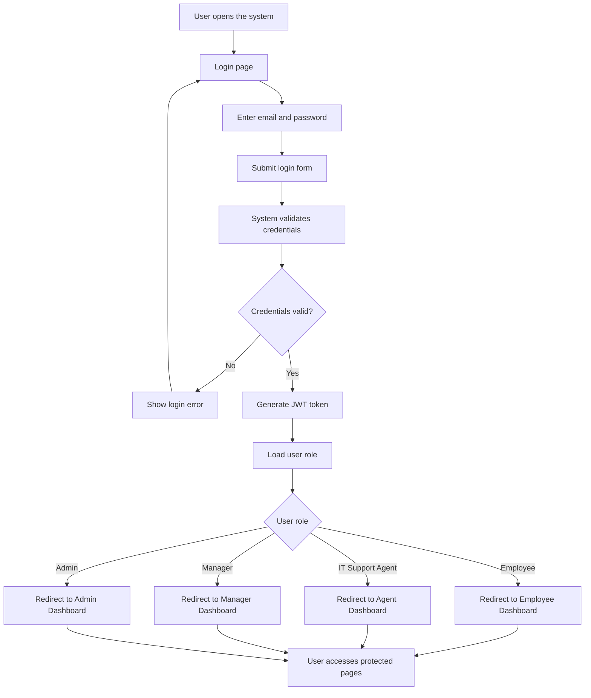
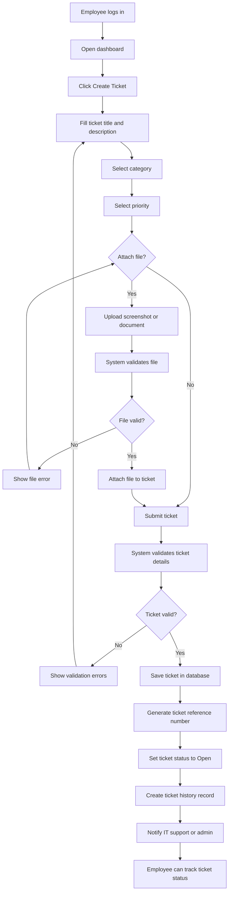
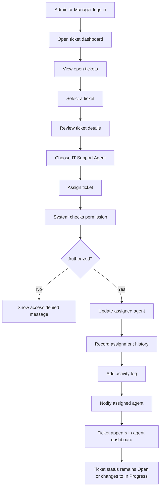
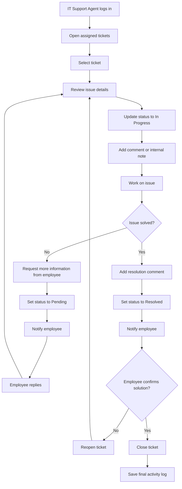
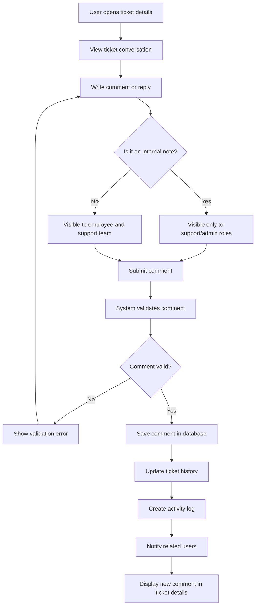
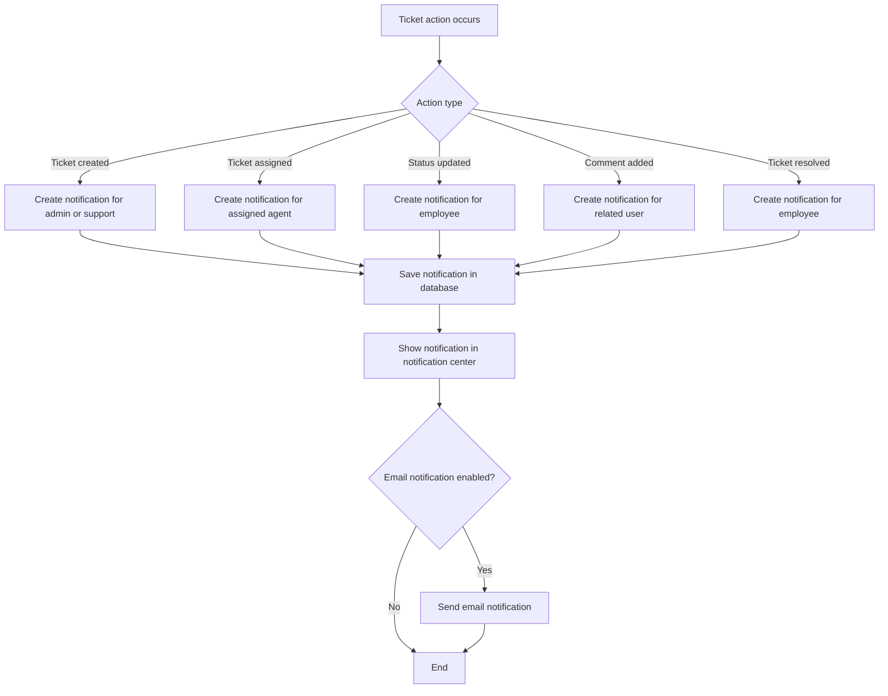
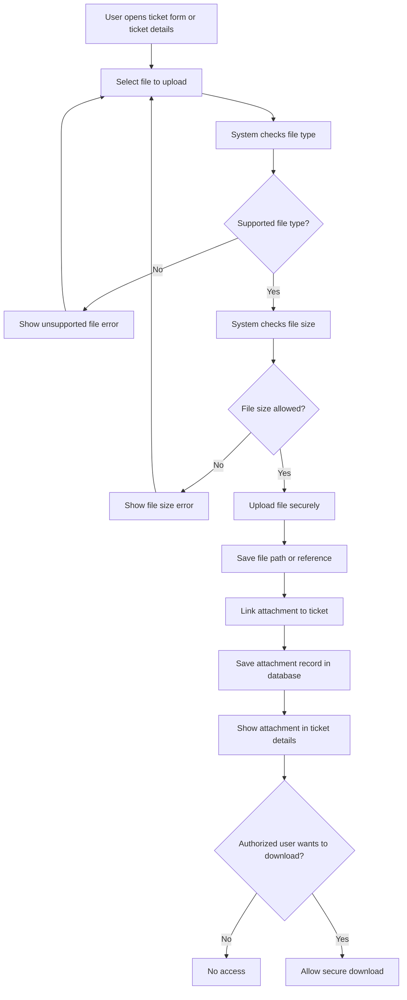
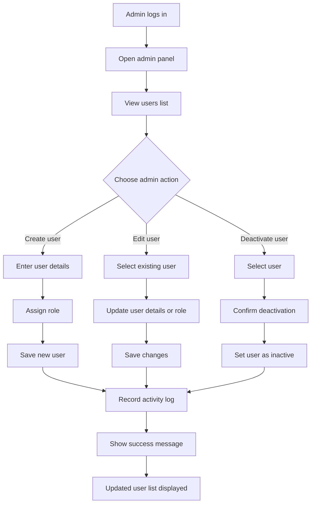

# System Workflows

## 1. Login / Authentication Workflow

## 2. Employee Create Ticket Workflow

## 3. Ticket Assignment Workflow

## 4. Ticket Resolution Workflow

## 5. Ticket Comment / Reply Workflow

## 6. Notification Workflow

## 7. File Attachment Workflow

## 8. Admin User Management Workflow

